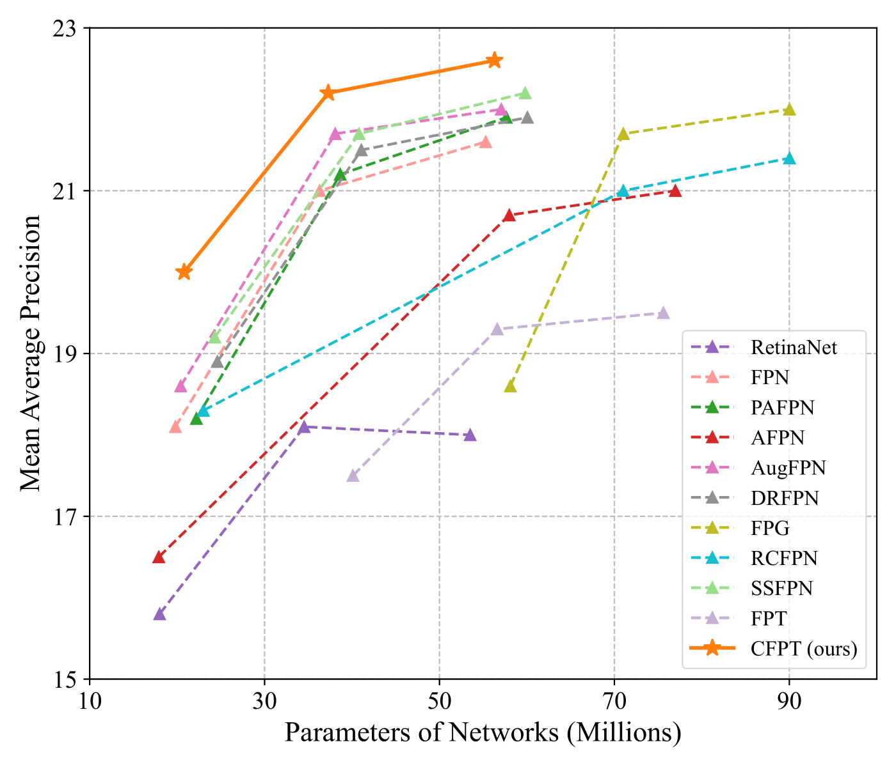
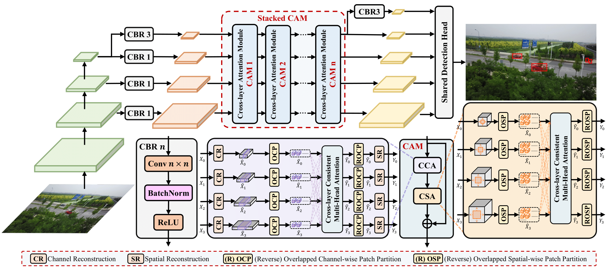

# Cross-Layer Feature Pyramid Transformer for Small Object Detection in Aerial Images
This repository provides the official PyTorch implementation of **CFPT**.

In this [paper](https://arxiv.org/abs/2407.19696), we propose the cross-layer feature pyramid transformer designed for small object detection in aerial images.

Below is the performance comparison with other feature pyramid networks based on RetinaNet on the VisDrone-2019 DET dataset.
<p align="center">

</p>

The architecture of CFPT is as described below.
<p align="center">

</p>

## Weights
Due to the accidental deletion of the model weights prepared for this paper, we retrained the entire network, resulting in slight differences in performance metrics compared to the original study.
Model | AP | Log | Link1 | Link2 |
--- |:---:|:---:|:---:|:---:
retinanet_r18_cfpt             | 20.0  | [Log](https://github.com/duzw9311/CFPT/blob/main/resources/retinanet_r18_cfpt.log) | [BaiduNetDisk](https://pan.baidu.com/s/1TkfGcwrp-27nMSXMFas27w?pwd=ael1) | [GoogleDrive](https://drive.google.com/file/d/1toxJzG18I4mCW_CwhG3NQ0uoquhJB6Pg/view?usp=drive_link)
retinanet_r50_cfpt              | 22.4 | [Log](https://github.com/duzw9311/CFPT/blob/main/resources/retinanet_r50_cfpt.log) | [BaiduNetDisk](https://pan.baidu.com/s/1oNGWQdcdUqaxwplltYydag?pwd=08nv) | [GoogleDrive](https://drive.google.com/file/d/13yp1FYhMf63ZiAzC-ulO1FMl5cImJmDS/view?usp=drive_link)
retinanet_r101_cfpt             | 22.6 | [Log](https://github.com/duzw9311/CFPT/blob/main/resources/retinanet_r101_cfpt.log) | [BaiduNetDisk](https://pan.baidu.com/s/1jWf3vYDW253y7eIqJ1AUYg?pwd=7n7p) | [GoogleDrive](https://drive.google.com/file/d/15MC5C7jOUjgr1DMHGmUpvs7xjvWMR6-J/view?usp=drive_link)

## Installation
Our experiments are based on torch 1.10+cu113, mmdet 2.24.1 and mmcv-full 1.6.0.

Please see [get_started.md](https://github.com/duzw9311/CFPT/blob/main/docs/en/get_started.md) for the basic usage of MMDetection.

1. Install PyTorch.

2. Install mmcv-full and MMDetection toolbox.
    ```bash
    pip install openmim
    mim install mmcv-full==1.6.0
    ```

3. Install albumentations and other packages.
    ```bash
    pip install einops
    pip install timm
    pip install yapf==0.40.1
    pip install albumentations==1.1.0
    ```

4. Clone and install this repository.
    ```bash
    git clone https://github.com/duzw9311/CFPT.git
    cd ./CFPT
    pip install -e .
    ```

## Usage
### Data Preparation
Download the VisDrone2019-DET dataset converted to COCO annotation format. You can download it from this [link](https://pan.baidu.com/s/1H_MtU-eSGI5jUJE-EcLynQ?pwd=2e3t).

### Training
```bash
python tools/train.py configs/CFPT/retinanet_r18_cfpt_1x_visdrone.py 
```

### Testing
```bash
python tools/test.py configs/CFPT/retinanet_r18_cfpt_1x_visdrone.py work_dirs/retinanet_r18_cfpt_1x_visdrone/latest.pth --eval bbox
```

## Acknowledgement
This repository is built upon the MMDetection library. Thanks to the authors of [CEASC](https://github.com/Cuogeihong/CEASC) and other researchers in the field of object detection for their open-source code.

## Citation
If you find this paper helpful for your project, we'd appreciate it if you could cite it.
```
@article{du2024cross,
  title={Cross-Layer Feature Pyramid Transformer for Small Object Detection in Aerial Images},
  author={Du, Zewen and Hu, Zhenjiang and Zhao, Guiyu and Jin, Ying and Ma, Hongbin},
  journal={arXiv preprint arXiv:2407.19696},
  year={2024}
}
```